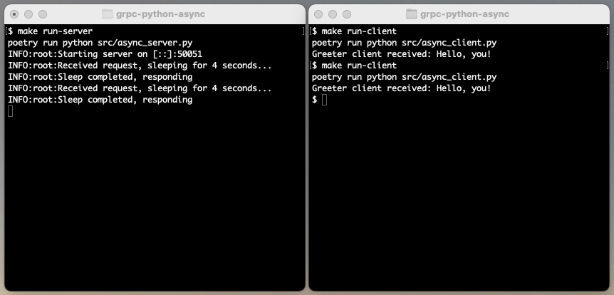

# gRPC with async Python

Proof of concept running an async [gPRC](https://grpc.io/docs/what-is-grpc/introduction/) server and client in Python. Based on examples from https://github.com/grpc/grpc/tree/master/examples/python.

### Development

1. Install packages `poetry install`
2. Build gRPC code from `.proto` service definition `make build`
3. Run server `make run-server`
4. Run client `make run-client`